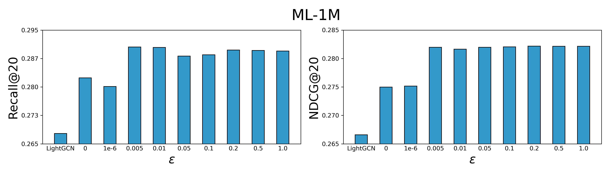
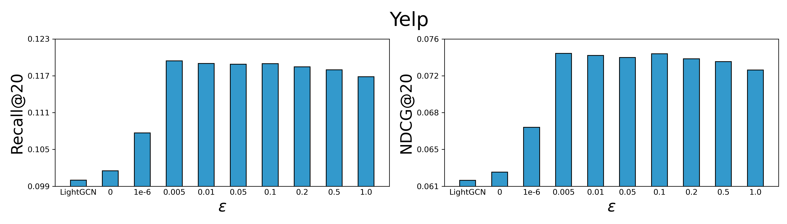

# Experiment Results

## ML-1M

|                    | R@10   | N@10   | R@20   | N@20   | R@50   | N@50   |
| ------------------ | ------ | ------ | ------ | ------ | ------ | ------ |
| $\epsilon$=0     | 0.1858 | 0.2635 | 0.2823 | 0.2754 | 0.4502 | 0.3246 |
| $\epsilon$=1e-6  | 0.1852 | 0.2647 | 0.2801 | 0.2756 | 0.4493 | 0.3252 |
| $\epsilon$=0.005 | 0.1924 | 0.2698 | 0.2903 | 0.2824 | 0.4574 | 0.3320 |
| $\epsilon$=0.01  | 0.1934 | 0.2694 | 0.2901 | 0.2821 | 0.4581 | 0.3321 |
| $\epsilon$=0.05  | 0.1927 | 0.2709 | 0.2879 | 0.2824 | 0.4572 | 0.3320 |
| $\epsilon$=0.1   | 0.1928 | 0.2709 | 0.2882 | 0.2825 | 0.4571 | 0.3320 |
| $\epsilon$=0.2   | 0.1928 | 0.2701 | 0.2895 | 0.2826 | 0.4579 | 0.3322 |
| $\epsilon$=0.5   | 0.1927 | 0.2701 | 0.2894 | 0.2826 | 0.4583 | 0.3322 |
| $\epsilon$=1.0   | 0.1926 | 0.2701 | 0.2892 | 0.2826 | 0.4582 | 0.3322 |

## Yelp

|                    | R@10   | N@10   | R@20   | N@20   | R@50   | N@50   |
| ------------------ | ------ | ------ | ------ | ------ | ------ | ------ |
| $\epsilon$=0 | 0.0628 | 0.0487 | 0.1016 | 0.0622 | 0.1836 | 0.0860 |
| $\epsilon$=1e-6 | 0.0668 | 0.0526 | 0.1078 | 0.0668 | 0.1918 | 0.0912 |
| $\epsilon$=0.005 | 0.0750 | 0.0590 | 0.1196 | 0.0744 | 0.2100 | 0.1007 |
| $\epsilon$=0.01  | 0.0748 | 0.0588 | 0.1192 | 0.0742 | 0.2101 | 0.1006 |
| $\epsilon$=0.05  | 0.0749 | 0.0587 | 0.1191 | 0.0740 | 0.2088 | 0.1001 |
| $\epsilon$=0.1   | 0.0753 | 0.0591 | 0.1191 | 0.0744 | 0.2108 | 0.1010 |
| $\epsilon$=0.2   | 0.0743 | 0.0584 | 0.1186 | 0.0738 | 0.2085 | 0.1000 |
| $\epsilon$=0.5   | 0.0744 | 0.0584 | 0.1181 | 0.0736 | 0.2074 | 0.0996 |
| $\epsilon$=1.0   | 0.0733 | 0.0576 | 0.1170 | 0.0727 | 0.2070 | 0.0989 |

# Hyper-Parameter Analysis

From the above experimental results, it is obvious that setting the $\epsilon$ parameter to extremely low values (e.g., 0 or 1e-6), leads to a marked decrease in model performance. This is mainly because such minor perturbations, while maintaining semantic invariance to some extent, cannot sufficiently introduce the expected contrastive hardness. As a result, the model cannot achieve good converge performance and fails to acquire adequate difficult knowledge to widen model vision for understanding and improving the generalization ability. On the contrary, when the $\epsilon$ is set within a relatively larger range, RGCL is allowed to **adaptively adjust instance-level perturbations within the constraints of decision boundary-aware perturbation**. This highlights RGCL's robust tolerance.
