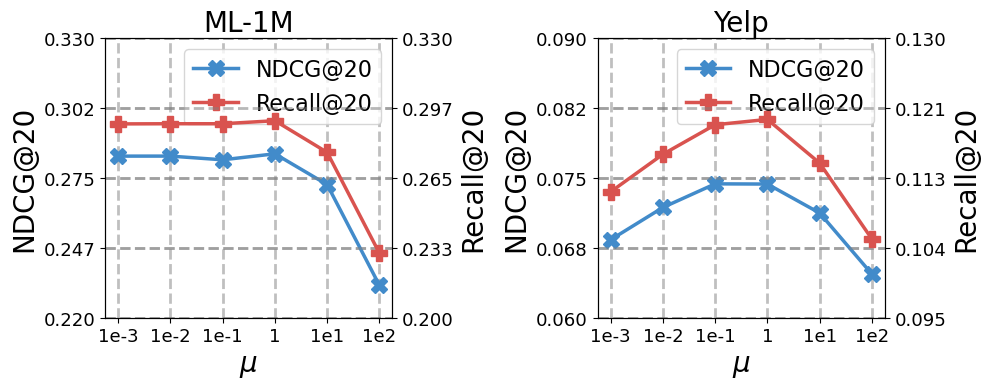

# Experimental Results

## ML-1M

|          | R@10             | N@10   | R@20   | N@20   | R@50   | N@50   |
| -------- | ---------------- | ------ | ------ | ------ | ------ | ------ |
| mu=0.001 | 0.1953           | 0.2729 | 0.2901 | 0.2835 | 0.4568 | 0.3327 |
| mu=0.01  | 0.1957 | 0.2731 | 0.2901 | 0.2835 | 0.4571 | 0.3327 |
| mu=0.1   | 0.1934           | 0.2694 | 0.2901 | 0.2821 | 0.4581 | 0.3321 |
| mu=1.0   | 0.1926           | 0.2711 | 0.2915 | 0.2844 | 0.4624 | 0.3351 |
| mu=10.0  | 0.1820           | 0.2608 | 0.2768 | 0.2723 | 0.4470 | 0.3222 |
| mu=100.0 | 0.1499           | 0.2256 | 0.2300 | 0.2328 | 0.3772 | 0.2744 |

## Yelp

|          | R@10   | N@10   | R@20   | N@20   | R@50   | N@50   |
| -------- | ------ | ------ | ------ | ------ | ------ | ------ |
| mu=0.001 | 0.0686 | 0.0538 | 0.1107 | 0.0684 | 0.1973 | 0.0936 |
| mu=0.01  | 0.0726 | 0.0569 | 0.1154 | 0.0718 | 0.2043 | 0.0976 |
| mu=0.1   | 0.0753 | 0.0591 | 0.1191 | 0.0744 | 0.2108 | 0.1010 |
| mu=1.0   | 0.0746 | 0.0587 | 0.1198 | 0.0743 | 0.2108 | 0.1008 |
| mu=10.0  | 0.0725 | 0.0567 | 0.1143 | 0.0712 | 0.2014 | 0.0965 |
| mu=100.0 | 0.0652 | 0.0508 | 0.1048 | 0.0647 | 0.1861 | 0.0883 |

# Hyper-Parameter Analysis

Our results show that too small $\mu$ may negatively impact the robustness by allowing the contrastive loss to dominate, while too high $\mu$ leads to poor performance due to excessively large step updates and also diminishes the benefits from GCL. Therefore, recommend the range of [0.1, 1] for good performance.
